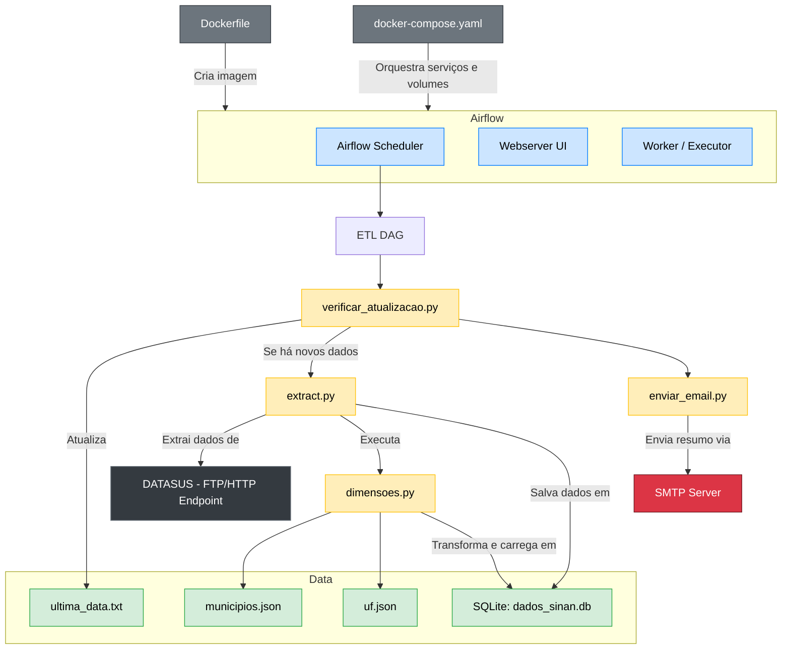

# 🦟 DataEng_Dengue

Projeto de Engenharia de Dados para análise e monitoramento de casos de **Dengue** a partir de dados públicos do **DATASUS**. O objetivo é estruturar um pipeline completo de ETL utilizando **Apache Airflow**, armazenamento em **SQLite** e extração de insights por meio de **consultas SQL**.

## 📊 Dados

- **Fonte dos dados:**  
  [DATASUS - SINAN Dengue](https://opendatasus.saude.gov.br/dataset/arboviroses-dengue)

  [Código Municípios - IBGE](https://www.ibge.gov.br/explica/codigos-dos-municipios.php)
- **Descrição:**  
  Os dados utilizados são oriundos do **Sistema de Informação de Agravos de Notificação (SINAN)**, especificamente focados nos casos de **Dengue notificados em Pernambuco**. O dataset contém variáveis clínicas, sociodemográficas e geográficas, incluindo sintomas, comorbidades, sinais de gravidade, entre outros.

- **Por que esses dados?**  
  A escolha foi motivada pela relevância **epidemiológica e social** da dengue no Brasil. Além disso, trata-se de uma base pública, rica e padronizada, com potencial para gerar análises que subsidiem **políticas de saúde pública**, especialmente sobre **populações de risco** e **eficiência na vigilância epidemiológica**.

## ⚙️ Extração e Transformação

O pipeline de ETL foi orquestrado utilizando o **Apache Airflow**, e o fluxo pode ser resumido conforme o diagrama abaixo:



## 💽 Tecnologias utilizadas

- **Apache Airflow** para orquestração de tarefas  
- **Python** para scripts de extração, transformação e carga  
- **SQLite** como banco de dados local para persistência  
- **Docker** e **Docker Compose** para containerização do ambiente  

---

## 🚀 Como subir a aplicação com Docker

1. **Suba os containers** com o seguinte comando:

   ```bash
   docker-compose up -d

2. Aguarde alguns segundos enquanto o Apache Airflow inicializa os serviços.

3. Acesse o Airflow através do navegador:

    http://localhost:8080

4. Use as seguintes credenciais para login:

    Usuário: airflow

    Senha: airflow

## 🛠️ Dica para testar a extração novamente
Se quiser ver a extração de dados acontecendo novamente, você pode forçar isso excluindo o arquivo ultima_data.txt, que está localizado na pasta **data/ultima_data.txt**
Esse arquivo armazena a última data de extração realizada no site do SINAN. Ao removê-lo, o DAG (quando iniciar) irá considerar que uma nova extração precisa ser feita.

## 🔍 Consultas SQL
# 1. Casos com Comorbidades Graves
- **Objetivo:**
Identificar pacientes com hospitalização, comorbidades (diabetes, hipertensão, hepatopatias) ou sinais de gravidade, possibilitando o monitoramento de populações vulneráveis e demanda por leitos hospitalares.

- **Por que essa consulta?**
Oferece uma visão crítica sobre os casos mais graves e complexos, permitindo uma estratificação de risco e tomada de decisão clínica/estratégica.

# 2. Tempo entre Sintomas e Notificação
- **Objetivo:**
Calcular o número de dias entre a data dos primeiros sintomas e a data da notificação, avaliando a eficiência da resposta da vigilância epidemiológica.

- **Por que essa consulta?**
Permite diagnosticar atrasos na comunicação entre os serviços de saúde e detectar possíveis gargalos na cadeia de notificação.

## 🏁 Desafios e melhorias futuras
- A estrutura dos dados do DATASUS é complexa, fragmentada em diferentes dicionários e formatos. Foi necessário um esforço inicial para encontrar uma boa base de dados, decodificar os dados categóricos e relacionar com suas dimensões descritivas.

- Um dos principais obstáculos foi a extração de um grande volume de dados (+25GB). Inicialmente, rodando localmente ainda era possível armazenar os dados em memória. Mas, depois de construir a aplicação completa do Airflow isso se tornou um problema. A solução seria adicionar uma camada de ferramentas para big data como pyspark.

- Substituir o SQLite por um banco mais robusto dependendo da arquitetura do time.
